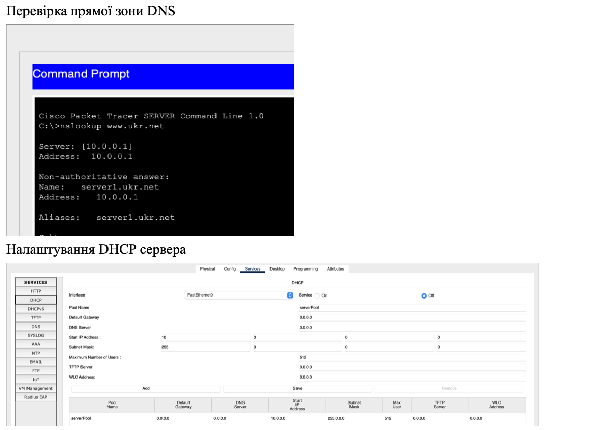
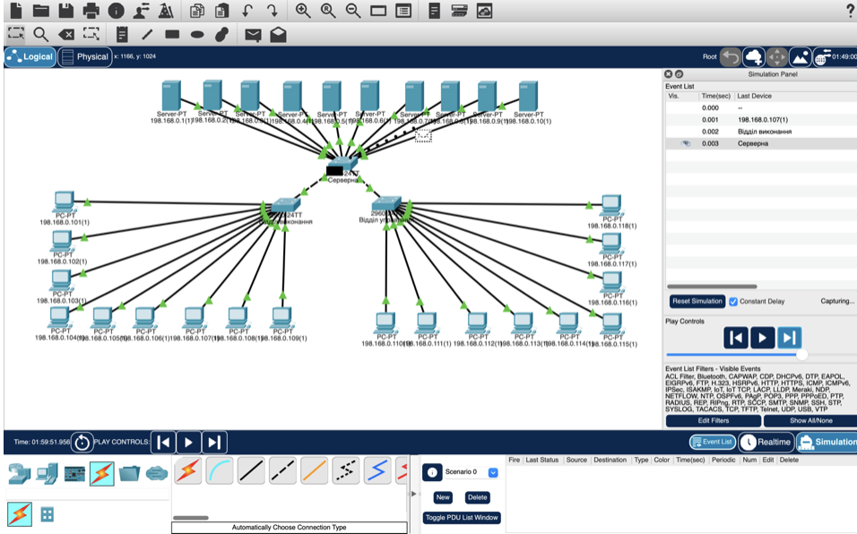
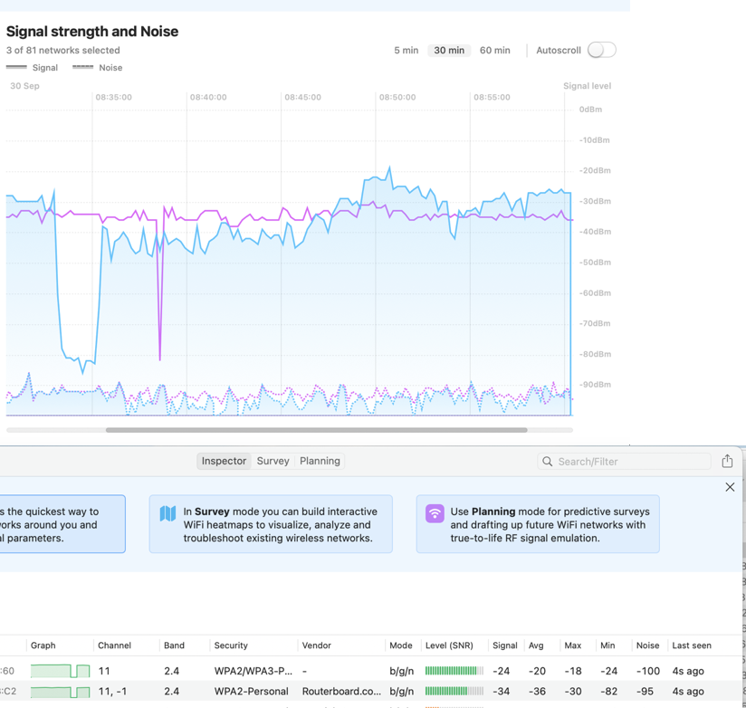

# 💻 Лабораторні з дисципліни "Організація комп’ютерних мереж"

## 📘 Опис

Цей репозиторій містить лабораторні роботи, виконані в межах вивчення курсу **"Організація комп’ютерних мереж"**. Для моделювання мережевих топологій, конфігурацій та аналізу роботи мережі було використано програмне середовище **Cisco Packet Tracer**.

## 🔧 Основні теми лабораторних

- Створення базових локальних мереж (LAN) із використанням комутаторів та маршрутизаторів.
- Налаштування IP-адресації (IPv4 та IPv6).
- Статична та динамічна маршрутизація (RIP, OSPF).
- VLAN та міжвланова маршрутизація.
- DHCP-сервер і його конфігурація.
- NAT (статичний та динамічний).
- Основи безпеки мереж (ACL, захист доступу).
- Аналіз трафіку та налагодження мережевих помилок.

## 🧪 Приклад реалізованої топології

На зображенні нижче — приклади побудованих мережевих моделей у Cisco Packet Tracer:
1.

2.

3.

